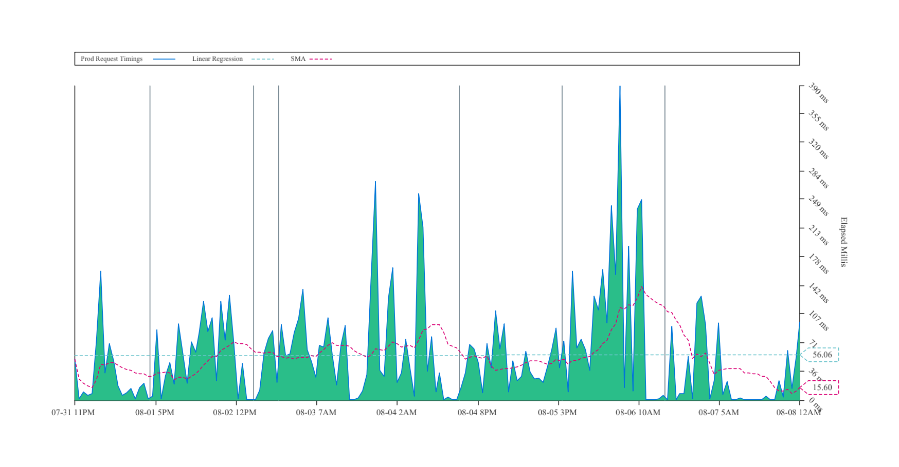

unichart
========

unichart is a native Golang charting library that supports timeseries
and continuous line charts.

# Installation

```bash
go get -u github.com/unidoc/unichart
```

# Examples

For usage samples, see the [examples](examples) directory.



# License

This project is licensed under the [MIT license](https://opensource.org/licenses/MIT).
See [LICENSE](LICENSE) for more details.

A commercial license is required in order to use this project with [unipdf](https://github.com/unidoc/unipdf).
There are two options:

- Metered License API keys.
  - Free ones can be obtained at https://cloud.unidoc.io.
- Offline Perpetual codes.
  - Can be purchased at https://unidoc.io/pricing.

# Credits

This is a modified fork of [wcharczuk/go-chart](https://github.com/wcharczuk/go-chart).
